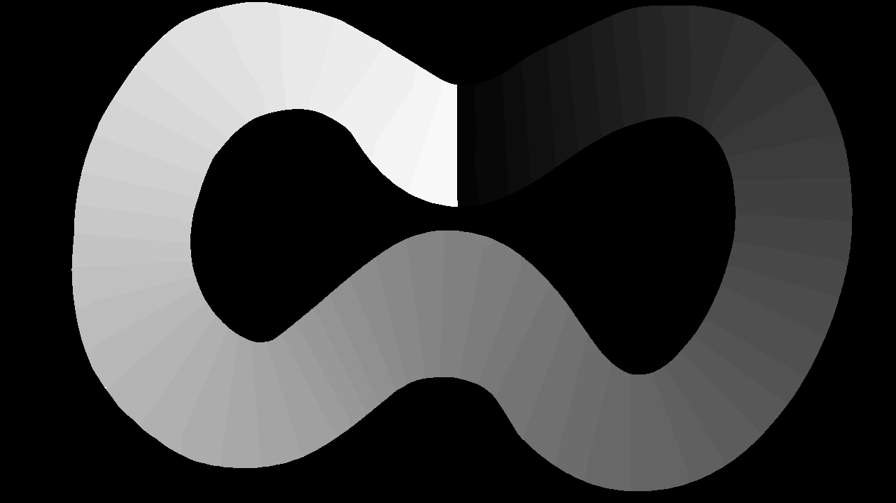

# Checkpoints in the Owl-Racer  

---

## An example of how checkpoints work  

For level 1 the Server reads the level1_cpm.png file.  
In there, the track is divided into small zones.   

Zones are colour coded. From start to finish,  
the rgb values of these zones increases by 4 for every  
zone. The first zone has the values r = 4, g = 4, b = 4.  
The second zone is r = 8, g = 8, b = 8 and so on.  
Grass is always r = 0, g = 0 and b = 0.  
	
The GameService reads out the red value of the car's current  
position on this map. Then it distinguishes cases such as  
crossing the finish line or going in the wrong direction.  

---	

## 	Creation of level1_cpm.png for level 1

1. Open the level1.png file with an image manipulation program  
2. Colour the non-transparent parts in black  
3. Select the transparent race track with the smart area-detection tool  
4. Colour the first zone after the finish line in rgb(r=4, g=4, b=4)  
5. Colour in more zones increasing the rgb value by 4 from zone
to zone. In the end you should aim at around 60 Zones.  
6. Make minor adjustments for pixels that werent covered
by the method above    
